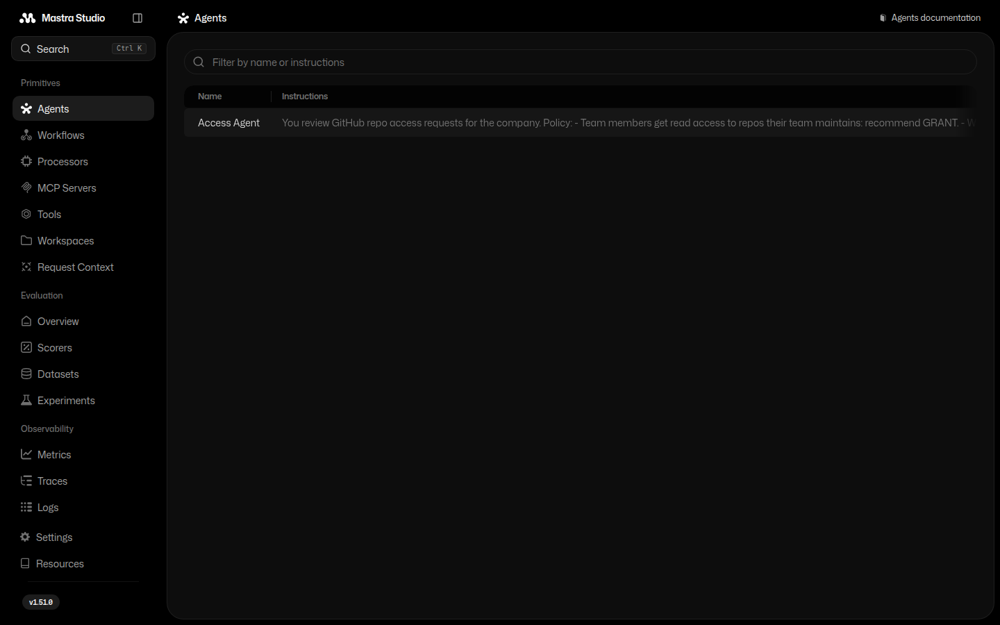
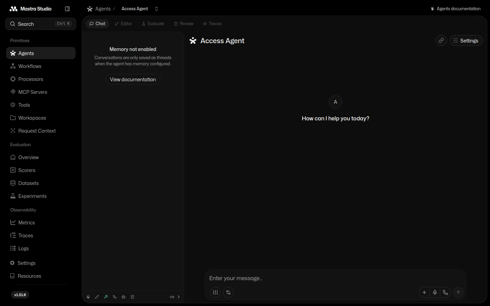
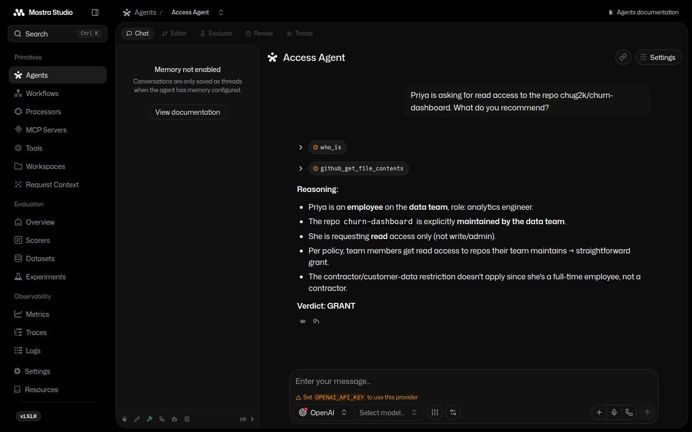

# Week 2 — The Access Agent in Mastra Studio

The spike scripts (`spike-agent.ts`, `spike-github-mcp.ts`) ran outside Mastra's
registry. Here we port the agent into the project so Studio can see it.
(Why Mastra and not something else? See [WHY-MASTRA.md](WHY-MASTRA.md).)

## 1. Port the agent into the registry

- `src/mastra/tools/who-is.ts` — the fake-HR `who_is` tool.
- `src/mastra/tools/github-mcp.ts` — GitHub remote MCP client; ~44 tools exposed,
  we keep 3 (`get_file_contents`, `search_repositories`, `get_me`).
- `src/mastra/agents/access-agent.ts` — the agent: access-review policy in its
  instructions, LiteLLM proxy as the model, HR + GitHub tools.
- `src/mastra/index.ts` — registers the agent: `new Mastra({ agents: { accessAgent } })`.

Secrets live in `.env` (gitignored) — see `.env.example` for the shape.

The demo target is [`chug2k/churn-dashboard`](https://github.com/chug2k/churn-dashboard) —
a private fixture repo whose README declares the data team as maintainer. The agent
reads it during the GRANT run, so keep it around.

## 2. Boot Studio

```shell
cd week2 && npm install && npm run dev
```

Studio comes up at [localhost:4111](http://localhost:4111). The Access Agent is
in the agents list because it's registered in `src/mastra/index.ts`.



## 3. Open the agent

Click the agent to get its chat page. Note the tabs — Chat, Editor, Evaluate,
Traces — Studio is a workbench, not just a chat window.



## 4. Test it

Ask: *"Priya is asking for read access to the repo chug2k/churn-dashboard.
What do you recommend?"*

The agent calls `who_is` (HR says: employee, data team), then
`github_get_file_contents` (the repo's README says the data team maintains it),
joins the two against the policy, and answers **Verdict: GRANT**.



That's the whole lesson loop: one agent, two systems, a policy — and Studio to
watch it think.
